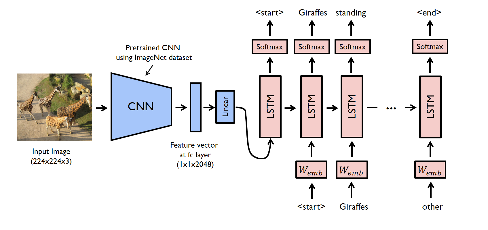

# Image Captioning

PyTorch image captioning project that uses a pretrained ResNet-152 encoder and an LSTM decoder to generate natural-language captions for images.

Repository: https://github.com/samruddhi02004/image-Captioning.git



## Overview

This project follows a standard encoder-decoder pipeline:

- `EncoderCNN` uses pretrained `ResNet-152` features.
- `DecoderRNN` uses an `LSTM` language model to generate captions token by token.
- Training uses the MS COCO 2014 caption annotations.
- Inference generates captions with greedy decoding.

## Project Structure

```text
image-Captioning/
|-- README.md
|-- LICENSE
`-- image_captioning/
    |-- build_vocab.py
    |-- data_loader.py
    |-- download.sh
    |-- model.py
    |-- requirements.txt
    |-- resize.py
    |-- sample.py
    |-- train.py
    `-- png/
```

## Prerequisites

- Python 3.8+
- PyTorch
- torchvision
- Pillow
- matplotlib
- nltk
- numpy
- `pycocotools`
- Bash utilities if you want to use `download.sh` directly: `wget`, `unzip`, `rm`

## Setup

Clone the repository:

```bash
git clone https://github.com/samruddhi02004/image-Captioning.git
cd image-Captioning/image_captioning
```

Install Python dependencies:

```bash
pip install -r requirements.txt
pip install torch torchvision pycocotools
python -m nltk.downloader punkt punkt_tab
```

Notes:

- `requirements.txt` in this repo does not include all runtime dependencies, so install the extra packages above as well.
- On Windows, `download.sh` is easiest to run from Git Bash or WSL.

## Dataset

This project expects the MS COCO 2014 caption dataset.

From inside `image_captioning/`, you can use the provided script:

```bash
chmod +x download.sh
./download.sh
```

The script downloads:

- `captions_train-val2014.zip`
- `train2014.zip`
- `val2014.zip`

and extracts them under `image_captioning/data/`.

If you do not want to use the shell script, manually create `image_captioning/data/` and place the extracted COCO files there so that these paths exist:

```text
data/
|-- annotations/captions_train2014.json
|-- train2014/
`-- val2014/
```

## Preprocessing

Build the vocabulary file:

```bash
python build_vocab.py \
  --caption_path data/annotations/captions_train2014.json \
  --vocab_path data/vocab.pkl
```

Resize the training images:

```bash
python resize.py \
  --image_dir data/train2014 \
  --output_dir data/resized2014 \
  --image_size 256
```

## Training

Train the model:

```bash
python train.py \
  --image_dir data/resized2014 \
  --caption_path data/annotations/captions_train2014.json \
  --vocab_path data/vocab.pkl \
  --model_path models/
```

Default training configuration:

- `embed_size=256`
- `hidden_size=512`
- `num_layers=1`
- `num_epochs=5`
- `batch_size=128`
- `learning_rate=0.001`

Checkpoints are saved in `models/` as:

- `encoder-{epoch}-{step}.ckpt`
- `decoder-{epoch}-{step}.ckpt`

## Inference

Generate a caption for an image:

```bash
python sample.py \
  --image png/example.png \
  --encoder_path models/encoder-5-3000.ckpt \
  --decoder_path models/decoder-5-3000.ckpt \
  --vocab_path data/vocab.pkl
```

Important:

- `sample.py` defaults reference `.pkl` checkpoint filenames.
- `train.py` actually saves checkpoints as `.ckpt`.
- Pass the saved `.ckpt` paths explicitly when running inference.

## How It Works

### Training

The encoder extracts visual features from each image using a pretrained CNN. Those features are projected into the embedding space and used by the LSTM decoder, which learns to predict the next caption token from the previous tokens.

### Inference

At test time, the decoder no longer has access to the ground-truth caption. It generates one word at a time and feeds each predicted word back into the LSTM until it reaches the end token or the maximum sequence length.

## Known Notes

- The code imports `pycocotools`, so the COCO API must be installed.
- `build_vocab.py` and `data_loader.py` use NLTK tokenization, so the tokenizer data must be downloaded before running them.
- `download.sh` assumes a Unix-like shell environment.

## License

This project is licensed under the MIT License. See [LICENSE](LICENSE).
